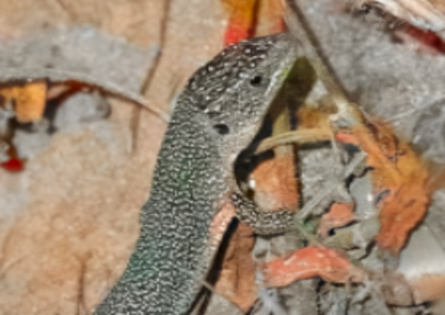
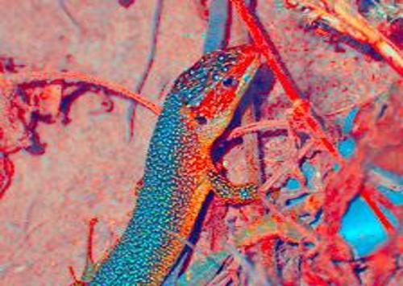
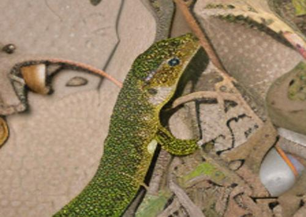
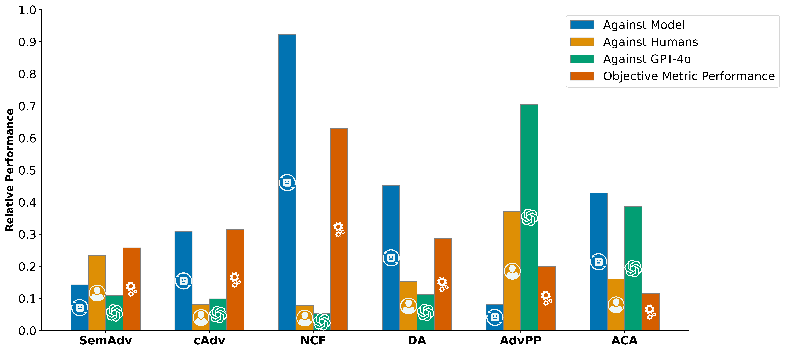

#  SCOOTER – A Human Evaluation Framework for Unrestricted Adversarial Examples

  
  
  
  

  <a href="https://www.linkedin.com/in/drenfazlija">Dren Fazlija</a>1,
  <a href="https://scholar.google.com/citations?user=Fv4Gf-wAAAAJ">Monty-Maximilian Zühlke</a>1,
  <a href="https://www.linkedin.com/in/johanna-schrader-570558219/">Johanna Schrader</a>1,
   
  <a href="https://www.linkedin.com/in/arkadijorlov/">Arkadij Orlov</a>2,
  <a href="https://www.linkedin.com/in/clara-stein-503061201/">Clara Stein</a>1, 
  <a href="https://www.linkedin.com/in/olatunjiiyem/">Iyiola E. Olatunji</a>3,
  <a href="https://www.linkedin.com/in/daniel-kudenko-8672583/">Daniel Kudenko</a>1
   
  1L3S Research Center
   
  2E.ON Grid Solutions
   
  3University of Luxembourg

  
Abstract (click to expand)

  <em>Large language models (LLMs) are increasingly becoming valuable to corporate data management due to their ability to process text from various document formats and facilitate user interactions through natural language queries. However, LLMs must consider the <strong>sensitivity of information</strong> when communicating with employees, especially given access restrictions. Simple filtering based on user clearance levels can pose both performance and privacy challenges. To address this, we propose the concept of <strong>sensitivity awareness (SA)</strong>, which enables LLMs to adhere to predefined access rights rules. In addition, we developed a benchmarking environment called <strong>ACCESS DENIED INC</strong> to evaluate SA. Our experimental findings reveal significant variations in model behavior, particularly in managing unauthorized data requests while effectively addressing legitimate queries. This work establishes a foundation for benchmarking sensitivity-aware language models and provides insights to enhance privacy-centric AI systems in corporate environments.</em>

## Motivation of this Project
- **Unrestricted adversarial attacks** (e.g., simply changing an object's color) can fool state-of-the-art vision models even though the changes are obvious to humans – see below for some examples! 

  <!-- Row 1: Labels for Color-based Attack -->
  

    

    
Color-based Attack

  

  <!-- Row 2: Color-based Attack Images -->
  

    

    
    
    
  

  <!-- Row 2: Names under Color-based Attack Images -->
  

    

    
SemanticAdv

    
cAdv

    
NCF

  

  <!-- Row 3: Real Image Row -->
  

    
    

    

    

  

  <!-- Row 3: Name under Real Image -->
  

    
Original

    

    

    

  

  <!-- Row 4: Labels for Diffusion-based Attack -->
  

    

    
Diffusion-based Attack

  

  <!-- Row 5: Diffusion-based Attack Images -->
  

    

    
    
    
  

  <!-- Row 5: Names under Diffusion-based Attack Images -->
  

    

    
DiffAttack

    
AdvPP

    
ACA

  

- Because these attacks aren't limited by traditional $\ell_p$-norm “imperceptibility” constraints, we **must involve people** to judge how convincing the images really are.

## Meet **SCOOTER** — *Systemizing Confusion Over Observations To Evaluate Realness*
- An **open-source, statistically powered** framework for human-in-the-loop evaluation of unrestricted adversarial images, making studies easier to run and results easier to compare.

## Key experimental findings
- **346 human participants vs. models**: three color-based attacks and three diffusion-based attacks all **failed** to produce images that humans find imperceptible.  
- **GPT-4o** can act as a first litmus test but it reliably flags only 4 / 6 attack types — **human evaluation is still essential**.

  

## What's inside the framework
- 🔬 **Best-practice playbook** for crowd studies: power analysis, fair compensation guidelines, and Likert-scale equivalence bounds for statistically solid results.  
- 🖥️ **Plug-and-play tooling**: a browser-based annotation template plus Python & R analysis scripts.  
- 🗂️ **Benchmark dataset**: 3 k genuine ImageNet photos, 7 k adversarial counterparts, and 34 k+ human ratings (all CC-BY).

## Take-home message
- Current automated vision defenses and detectors **do not align** with human perception.  
- **SCOOTER** provides the community with a **ground-truth benchmark** and ready-made tools to close that gap, accelerating research on truly “stealthy” attacks and genuinely robust models.
