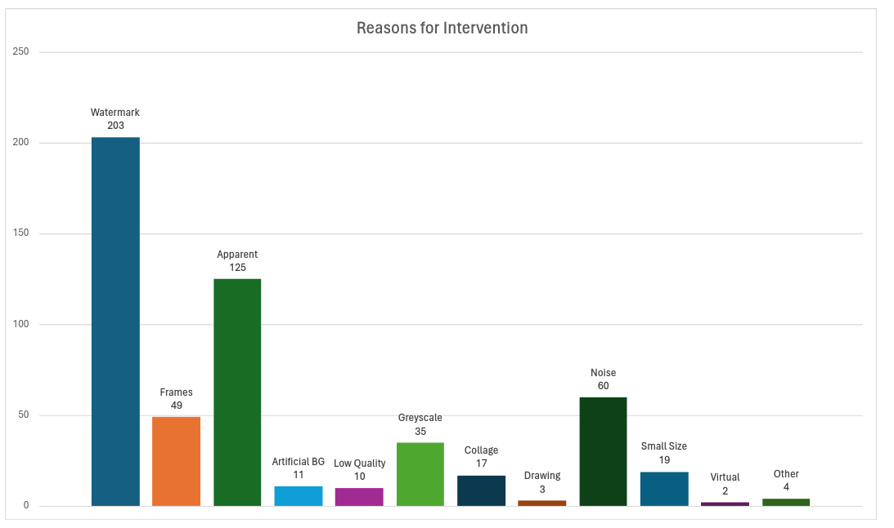

# ImageNet S-R50-N

## Rerunning the Processing
While you can find an exact breakdown of the manual processing below, we also provide the jupyter notebook `SalmanAnalysis.ipynb` which allows to gather the information one by one (simply run all the cells within the script).

> [!NOTE]
> You will need to download the predictions of the victim model "predictions_salman_clean.csv" to perform the processing. You can find the file in our Zenodo: https://doi.org/10.5281/zenodo.15771502

## Dataset Statistics

### Target Model
* Adversarially trained ResNet-50 model from RobustBench
* As of July 2025, it was the [most robust ResNet-50 model against $\ell_\infty$ perturbations](https://robustbench.github.io/#div_imagenet_Linf_heading)
* Adversarial Training procedure as proposed by [Salman et al. (2020)](https://arxiv.org/abs/2007.08489)

### The Dataset in a nutshell
* No. images: 2966
* No. classes: 995
* No. classes with three images: 982
* Total size: 409,4 MB

### Image Processing Statistics
* **447** / 1000 classes were *clean*
    * I.e., The top-3 images were usable without any further adjustments
* From the remaining **553** classes...
    * **21** classes were able to retain their top-3 images by simply cropping (a subset of) them to remove watermarks (i.e., we did not need to add top-5 images)
    *  **73** classes required additional images to fill up the class (i.e., the classes either already had less than three images due to the lack of *easy images* shared across the ensemble, or we had to remove more than two images from the original top-5)
        * **55** classes were successfully expanded to contain three images
        * **1** class (*web site*) was ignored entirely, as its images are inherently digital (screenshots)
        * **17** / 73 classes still ended up with fewer than three images
            * **4** / 17 classes have 0 valid images
            * **6** / 17 classes have exactly one valid image
            * **7** / 17 classes have exactly two valid images
        * In total, we had to remove **86** images from the original top-5, and had to add **109** new images based solely on the predictions of the Salman2020Do_R50 model!
    * For the remaining **459** classes, we had to substitute top-3 images with top-5 images of the ensemble!
        * **626** images from the original top-3 had to be removed!
        * For **57** / 459 classes, we had to crop substitutes from the top-5 before we could add them to the final set
        * The following figure visualizes the number of classes for which at least one top-3 image was removed due to a specific reason
            * E.g., Watermarks = 203 -> 203 / 459 classes contained at least one image in their original top-3 that was removed due to a non-croppable watermark.
            * Hence, classes generally contain multiple different types of reasons for image removal

            
             